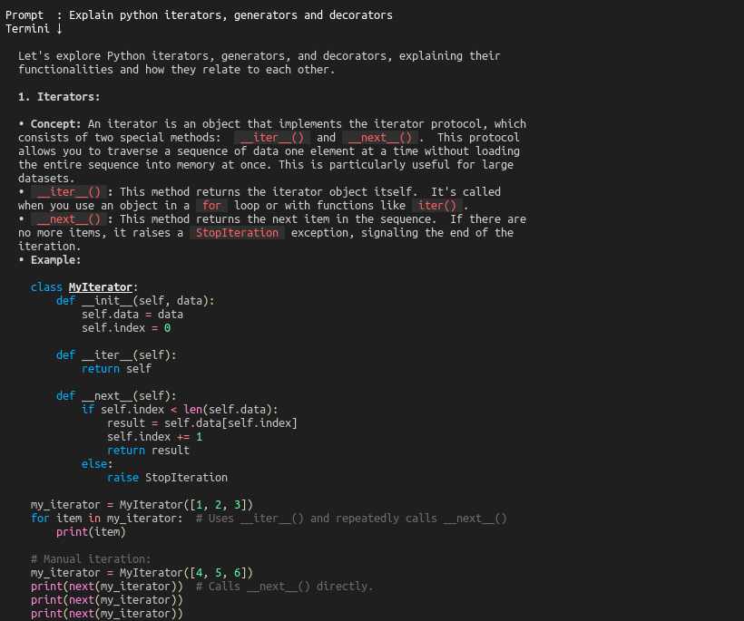

# Termini - AI Assistant Chatbot in the Terminal

Termini (**"Terminal Gemini"**) is an AI assistant chatbot designed to run directly from the terminal, allowing developers and users to interact with it and get responses without ever leaving the terminal environment. Whether you're coding, debugging, or researching, Termini can be your productivity booster, offering quick answers and generating content based on your prompts.

## Table of Contents

- [Introduction](#introduction)
- [Features](#features)
- [Dependencies](#dependencies)
- [Installation](#installation)
- [Usage](#usage)
- [Log File Format](#log-file-format)
- [Getting Started with API Key](#getting-started-with-api-key)
- [License](#license)
- [Contributing](#contributing)

## Introduction

This is a side hobby project built using Python that integrates Google's Gemini AI model to generate responses directly in your terminal. It enhances the developer's productivity by enabling them to interact with AI without leaving their coding environment.

## Features

- **AI-Generated Responses**: Termini uses the Gemini API to fetch responses for any input prompt.
- **Terminal-Based**: No need to leave the terminal to interact with AI.
- **Log Management**: Logs each prompt and response into a Markdown file, prepended with the timestamp, so you can keep track of your interactions.
- **Easy Installation**: Requires basic setup and an API key for interaction with the Gemini API.
- **Open Source**: Anyone can contribute or modify the project.

## Dependencies

To run Termini, you need the following dependencies installed:

- **Python 3**: A Python interpreter is required to run the script.
- **requests**: A Python library to handle HTTP requests.
- **subprocess**: To execute terminal commands for displaying results with `glow`.
- **glow**: A terminal-based markdown reader, useful for rendering markdown responses.

### Installing Dependencies

1. **requests** can be installed via pip:
   ```bash
   pip install requests
   ```
   or
   ```bash
   pip install -r requirements.txt
   ```

2. **glow** is a terminal-based markdown reader. You can install it on various operating systems using the following methods:

    - **Linux (Debian/Ubuntu-based distros)**:
      ```bash
      sudo apt install glow
      ```

    - **Linux (Arch-based distros)**:
      ```bash
      sudo pacman -S glow
      ```

    - **macOS (via Homebrew)**:
      ```bash
      brew install glow
      ```

    - **Windows (via Scoop)**:
      ```bash
      scoop install glow
      ```

    - **Windows (via Chocolatey)**:
      ```bash
      choco install glow
      ```

    - **Manual Installation**:
      You can also manually install `glow` by downloading the latest release from the [official GitHub page](https://github.com/charmbracelet/glow).

## Installation

To set up Termini, clone this repository and install the dependencies.

1. **Clone the repository**:
   ```bash
   git clone https://github.com/yourusername/termini.git
   cd termini
   ```

2. **Install dependencies**:
   You can install the required Python dependencies using `pip`:
   ```bash
   pip install -r requirements.txt
   ```

   Alternatively, you can manually install the dependencies like `requests`.

3. **Configure API Key**:
   You'll need an API key to interact with Google's Gemini model.

   - Get your free API key from [Google's AI Studio](https://aistudio.google.com/apikey).
   - Set the API key as an environment variable:
     ```bash
     export GEMINI_API_KEY="your_api_key_here"
     ```
   - Alternatively, you can manually hardcode the API key in the script by replacing `os.getenv("GEMINI_API_KEY")` with your actual key (not recommended for security reasons).

4. **Ensure log folder exists**:
   Termini creates logs in a user-specific folder (`~/Termini/log`). This is done automatically, but ensure the folder path is correct and accessible for your system.

## Usage

Once the setup is complete, you can start using Termini from the terminal:

```bash
python3 termini.py
```

### Sample Interaction:

```text
Prompt  : hello
Termini ↓

  Hello there! How can I help you today?

Log updated at /home/andrew/Termini/log/Termini_log.md

Prompt  : Who are you?
Termini ↓

  My name is Termini, an AI assistant chatbot that runs in the terminal 😊.

Log updated at /home/andrew/Termini/log/Termini_log.md

Prompt  : compose a 3-line poem
Termini ↓

  The moon, a pearl in velvet skies,
  Hangs heavy, watching silent cries,
  Of shadows long, where darkness lies.

Log updated at /home/andrew/Termini/log/Termini_log.md

Prompt  : bye
Termini ↓

  Byeee!!! Have a good time 😊.
```

## Log File Format

The log file (`Termini_log.md`) will store the following information for each interaction:

```markdown
**Timestamp**: 2024/11/19 15:45:30  
**Prompt**: hello  
**Termini**↓  
  Hello there! How can I help you today?

---

**Timestamp**: 2024/11/19 15:46:05  
**Prompt**: Who are you?  
**Termini**↓  
  My name is Termini, an AI assistant chatbot that runs in the terminal 😊.

---

**Timestamp**: 2024/11/19 15:47:12  
**Prompt**: compose a 3-line poem  
**Termini**↓  
  The moon, a pearl in velvet skies,  
  Hangs heavy, watching silent cries,  
  Of shadows long, where darkness lies.

---

**Timestamp**: 2024/11/19 15:48:00  
**Prompt**: bye  
**Termini**↓  
  Byeee!!! Have a good time 😊.
  
```

Each interaction is prepended with a timestamp and stored in Markdown format for easy readability.

## Getting Started with API Key

To get started with Termini, you must sign up for an API key from [Google's AI Studio](https://aistudio.google.com/apikey).

After obtaining your key:

1. Set it as an environment variable:
   ```bash
   export GEMINI_API_KEY="your_api_key_here"
   ```
   Or
2. Hardcode it directly in the script (not recommended):
   ```python
   apikey = "your_api_key_here"
   ```

This key will allow Termini to communicate with Google's Gemini model and generate content for your prompts.

## Maximize Developer Productivity

Termini is designed to maximize productivity by keeping you within the terminal. You can switch between your code editor/IDE and the terminal to interact with Termini, get information, or generate content, without having to leave your workspace.

## License

Termini is an open-source project licensed under the GPL-3.0 License. Feel free to fork and contribute to the project.

## Contributing

We welcome contributions to Termini! Whether it's fixing bugs, adding new features, or improving the documentation, your help is appreciated.

To contribute:

1. Fork the repository.
2. Create a new branch.
3. Make your changes.
4. Push the changes to your forked repository.
5. Create a pull request.

---

## Example
